# TP MSA - Modélisation des Signaux Aléatoires
## Compression de la Parole par Prédiction Linéaire (LPC)

**Réalisé par :** MBASSI EWOLO Loïc Aron & ABDOULKADER MOHAMED Yacoub  
**Groupe :** 2G3TD1P5  
**Formation :** ENSEA - Majeure Signal (Niveau 2)

---

## 📋 Contexte du Projet

Ce TP explore la **modélisation paramétrique des signaux aléatoires** appliquée à la compression de la parole. L'objectif principal est de mettre en œuvre la **prédiction linéaire (LPC)** pour extraire les paramètres du modèle source-filtre de la parole et réaliser une compression efficace.

Le projet couvre trois aspects fondamentaux :
1. **Estimation de l'autocorrélation** (estimateurs biaisés/non-biaisés)
2. **Analyse spectrale** (périodogramme, corrélogramme, fenêtrage)
3. **Prédiction linéaire** (équations de Yule-Walker, modèle AR)

---

## 🎯 Objectifs Pédagogiques

- Maîtriser les estimateurs statistiques pour processus aléatoires
- Comprendre les compromis biais-variance dans l'estimation spectrale
- Implémenter l'algorithme de Yule-Walker pour la modélisation AR
- Appliquer le codage LPC à des signaux de parole réels
- Distinguer sons voisés et non-voisés par analyse temps-fréquence

---

## 📊 Séance 1 : Estimation de l'Autocorrélation

### Signaux Tests

Trois signaux artificiels générés pour validation :

| Signal | Expression | Propriétés |
|--------|-----------|------------|
| **Bruit Blanc** | $X[n] \sim \mathcal{N}(0, \sigma_b^2)$ | Décorrélé, $\gamma[p] = \sigma^2 \delta[p]$ |
| **AR(1)** | $X[n] = -0.8 X[n-1] + B[n]$ | Corrélation exponentielle décroissante |
| **Sinusoïde** | $X[n] = A\cos(2\pi\nu_0 n + \phi)$ | Corrélation périodique |

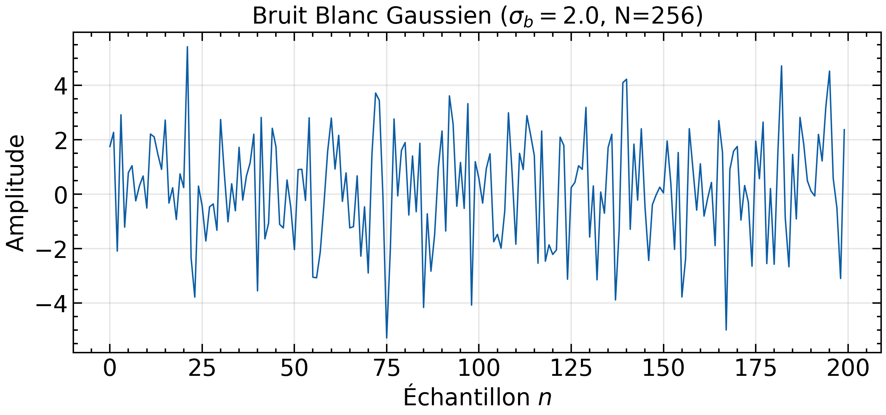
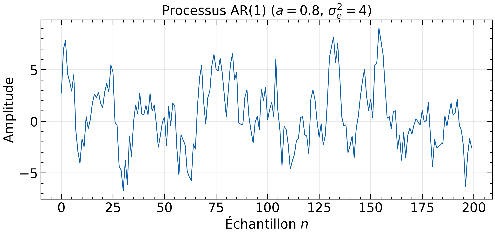
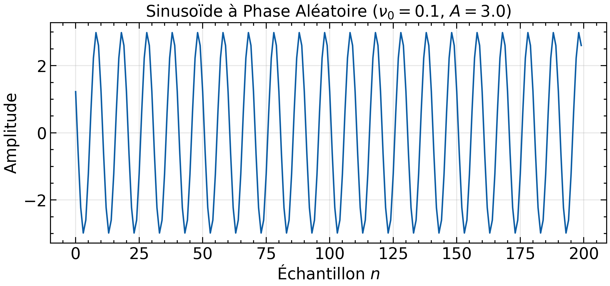

### Estimateur Biaisé

$$\hat{\gamma}_{X,b}[p] = \frac{1}{N} \sum_{k=0}^{N-1-|p|} x[k] x[k+|p|]$$

**Propriété :** Biaisé, mais variance plus faible. Préféré pour segments courts (parole).

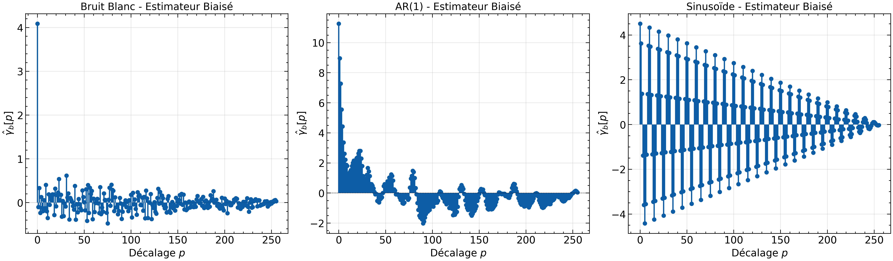

**Validation AR(1) :** Comparaison avec la théorie $\gamma[p] = \gamma[0] \cdot a^{|p|}$

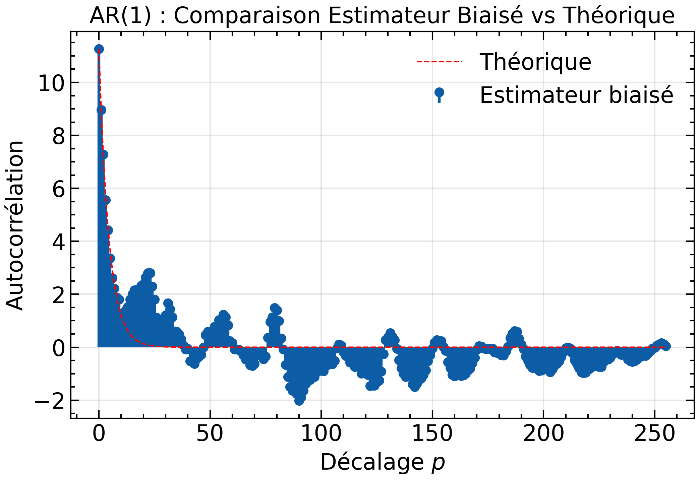

### Estimateur Non-Biaisé

$$\hat{\gamma}_{X,nb}[p] = \frac{1}{N-|p|} \sum_{k=0}^{N-1-|p|} x[k] x[k+|p|]$$

**Propriété :** Non biaisé, mais variance explose quand $p \to N$.

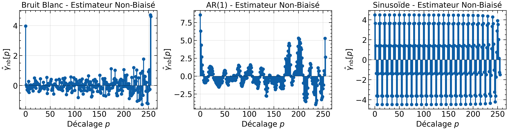

### Comparaison Biais vs Non-Biais

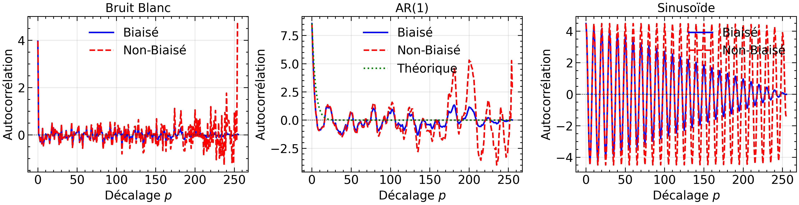

**Conclusion :** L'estimateur biaisé est privilégié pour la parole (segments courts, 20-30ms).

### Calcul Rapide par FFT

Implémentation via Théorème de Wiener-Khintchine : $\gamma_X[p] = \text{TFDI}(|X(\nu)|^2)$

**Gain de performance :** $\times 100$ plus rapide pour $N=10000$ échantillons.

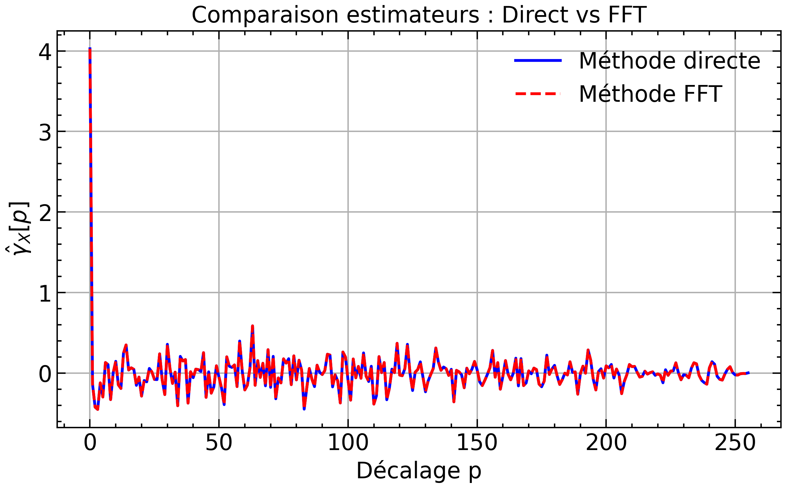

---

## 📈 Séance 2 : Analyse Spectrale

### Périodogramme vs Corrélogramme

| Méthode | Expression | Avantages | Inconvénients |
|---------|-----------|-----------|---------------|
| **Périodogramme** | $\hat{I}_N(\nu) = \frac{1}{N} \|X(\nu)\|^2$ | Rapide (FFT) | Non consistant |
| **Corrélogramme** | $\text{TFD}(\hat{\gamma}_X[p])$ | Lissage naturel | Coût calcul |

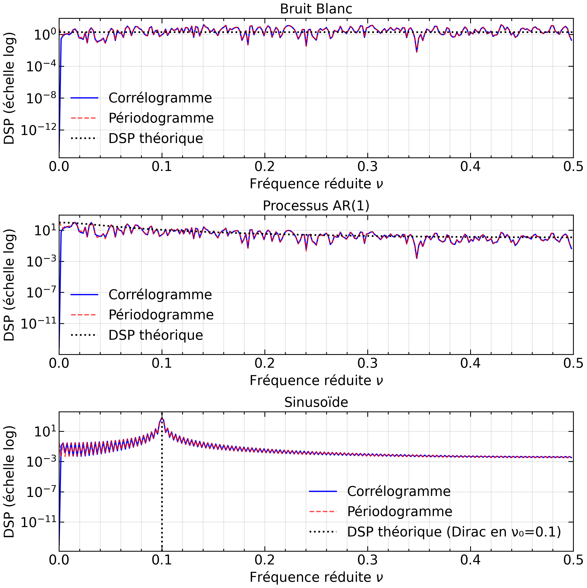

**Observation :** Le périodogramme présente de fortes fluctuations (variance ne diminue pas avec $N$).

### Moyennage de Bartlett

Réduction de variance par moyennage sur $K$ segments :

$$\hat{S}_{\text{moy}}(\nu) = \frac{1}{K} \sum_{i=1}^{K} \hat{I}_{N_s}^{(i)}(\nu)$$

**Effet :** Variance réduite d'un facteur $K$, mais résolution dégradée ($\Delta\nu \times K$).


### Fenêtrage Temporel

Contrôle des lobes secondaires par fenêtres : Rectangulaire, Hann, Hamming, Blackman.

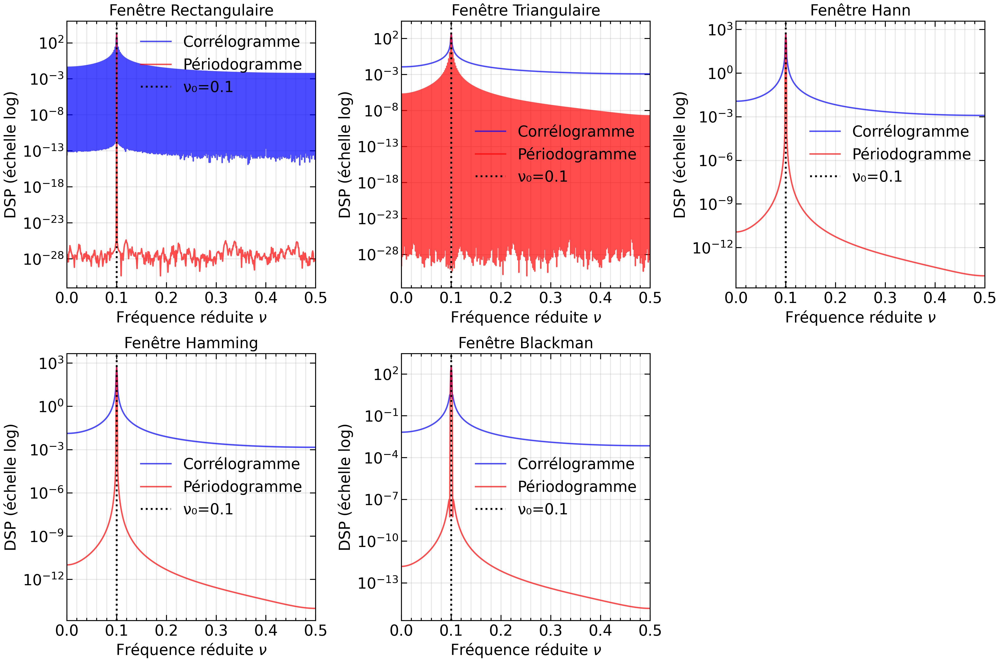

| Fenêtre | Lobe Principal | Rejection | Usage |
|---------|---------------|-----------|-------|
| **Rectangulaire** | $2/N$ | -13 dB | Résolution max |
| **Hann** | $4/N$ | -32 dB | Compromis général |
| **Hamming** | $4/N$ | -43 dB | Harmoniques proches |
| **Blackman** | $6/N$ | -58 dB | Rejection max |

---

## 🗣️ Application à la Parole

### Caractérisation Voisé/Non-Voisé

**Critère autocorrélation :** Détection d'un pic secondaire périodique (pitch $F_0$).

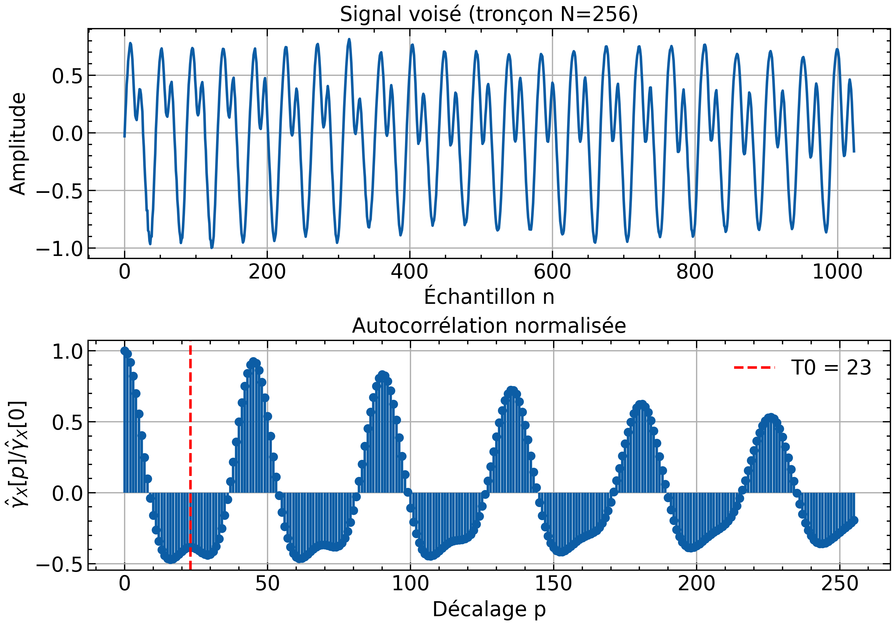
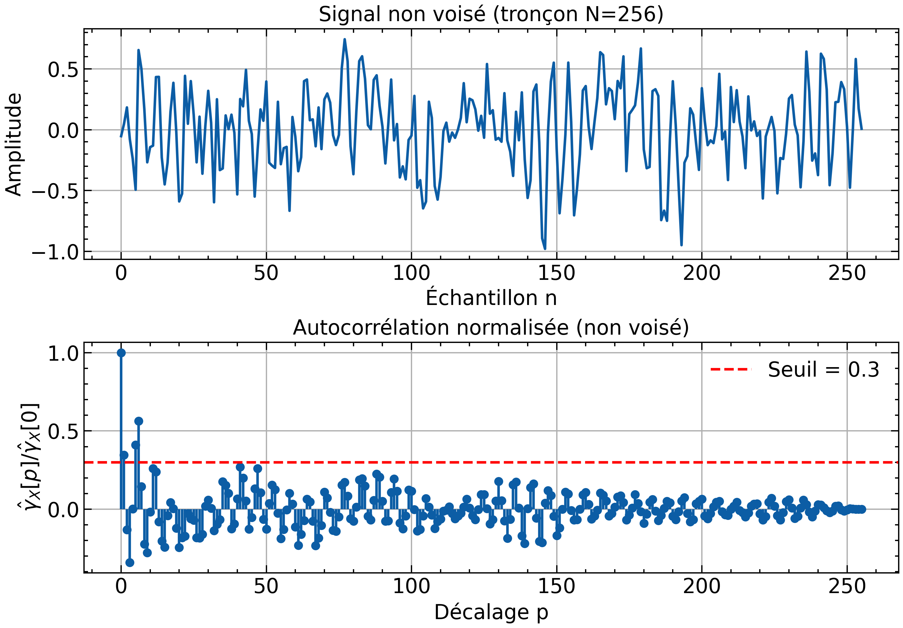

**Résultats :**
- **Voisé (voyelle /o/) :** $F_0 = 115$ Hz (période $T_0 \approx 87$ échantillons à 10 kHz)
- **Non-Voisé (consonne /s/) :** Pas de pic secondaire, décroissance rapide

---

## 🔧 Séance 3 : Prédiction Linéaire (LPC)

### Équations de Yule-Walker

Résolution du système matriciel pour un modèle AR(M) :

$$\boldsymbol{\Gamma}_M \cdot \mathbf{a} = -\boldsymbol{\gamma}_M$$

où $\boldsymbol{\Gamma}_M$ est la matrice de Toeplitz des autocorrélations.

**Variance de l'innovation :**

$$\sigma_e^2 = \gamma_X[0] + \sum_{k=1}^{M} a_k \gamma_X[k]$$

### Validation (Checkpoint 10)

Trois tests théoriques pour valider l'implémentation :

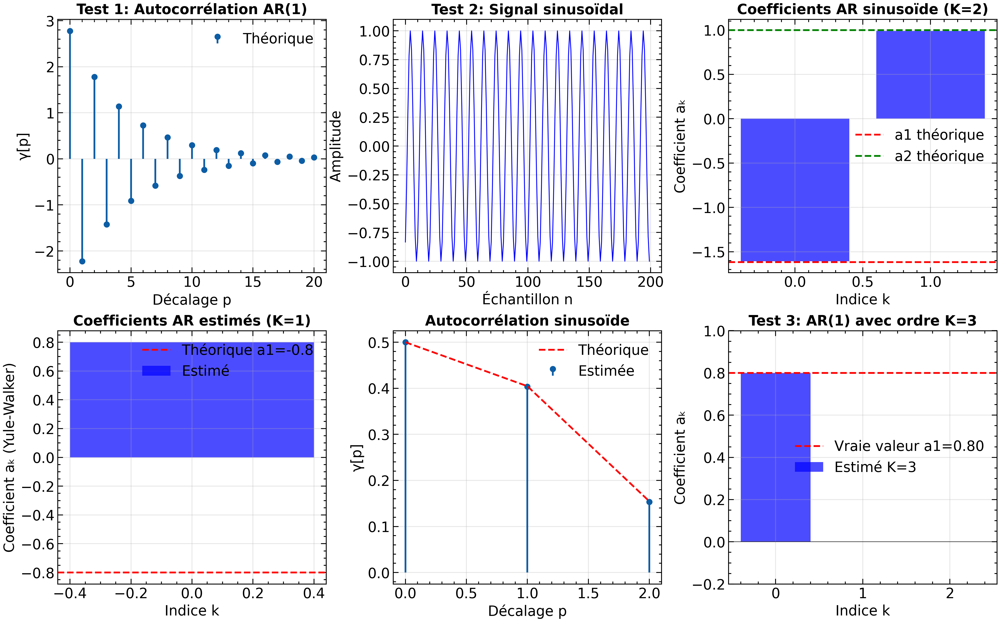

1. **AR(1)** : Retrouve $a_1 = 0.8$, $\sigma_e^2 = 1.0$ (précision machine)
2. **Sinusoïde** : Coefficients $a_1 \approx -2\cos(2\pi\nu_0)$, $a_2 \approx 1$
3. **Sur-paramétrage** : Coefficients excédentaires $\approx 0$

### Application Parole (Checkpoint 11)

Analyse voisé/non-voisé pour différents ordres $K \in \{2, 4, 8, 12, 16\}$ :

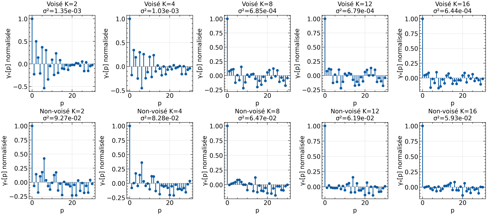

**Observations :**
- **Voisé :** $K \geq 10$ nécessaire (autocorrélation erreur → bruit blanc)
- **Non-Voisé :** $K = 8$ suffit (conduit vocal moins résonant)

**Interprétation physique :** $K=10$ à 10 kHz $\approx$ 5 formants (2 pôles/formant).

### Estimation Spectrale Paramétrique

DSP obtenue par le modèle AR(K) :

$$\hat{S}_{\text{AR}}(\nu) = \frac{\sigma_e^2}{|1 + \sum_{k=1}^K a_k e^{-j2\pi k\nu}|^2}$$

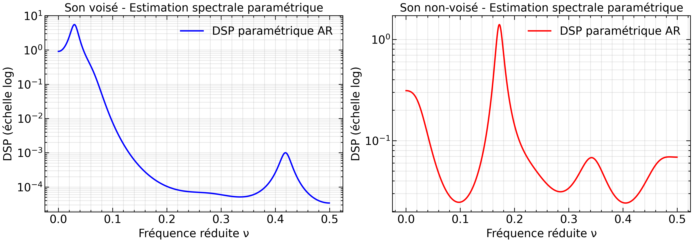

**Avantages LPC :**
- Compression : $K+1$ paramètres au lieu de $N$ échantillons
- Résolution : Meilleure pour segments courts
- Séparation source-filtre : Coefficients LPC = conduit vocal uniquement

---

## 📁 Structure du Projet

```
msa_tp/
├── msa_lab_2025.ipynb      # Notebook Jupyter principal
├── rapport_tp.tex          # Rapport LaTeX
├── rapport_tp.pdf          # Rapport compilé
├── README.md               # Ce fichier
├── requirements.txt        # Dépendances Python
├── figures/                # Graphiques générés
│   ├── *.png               # Toutes les figures du TP
├── logo/                   # Logos ENSEA
└── *.flac                  # Signaux audio de parole
```

---

## 🚀 Installation et Utilisation

### Prérequis

```bash
pip install -r requirements.txt
```

**Bibliothèques :** `numpy`, `scipy`, `matplotlib`, `soundfile`, `librosa`, `scienceplots`

### Exécution

1. **Notebook Jupyter :**
   ```bash
   jupyter notebook msa_lab_2025.ipynb
   ```

2. **Génération du rapport LaTeX :**
   ```bash
   pdflatex rapport_tp.tex
   ```

---

## 📚 Références Théoriques

- **Ergodisme :** Estimation par moyennes temporelles sur une réalisation
- **Théorème de Wiener-Khintchine :** DSP = TF de l'autocorrélation
- **Décomposition de Wold :** Processus = Prédictible + Innovation (bruit blanc)
- **Modèle Source-Filtre :** Parole = Excitation (pitch/bruit) × Filtre AR (conduit vocal)

---

## 🎓 Compétences Développées

- Manipulation de processus stochastiques (numpy)
- Estimation statistique (biais-variance)
- Analyse spectrale (FFT, fenêtrage)
- Modélisation paramétrique (Yule-Walker, LPC)
- Traitement de la parole (voisé/non-voisé, formants)
- Rédaction scientifique (LaTeX, matplotlib)

---

## 📝 Notes Importantes

- **Fréquence d'échantillonnage :** $F_e = 10$ kHz
- **Taille des fenêtres :** $N = 256$ échantillons (25.6 ms)
- **Ordre LPC recommandé :** $K = 10$ (parole à 10 kHz)
- **Convention :** Modèle AR $X[n] = -\sum a_k X[n-k] + B[n]$

---

**Date :** Décembre 2025  
**Contact :** ENSEA - Majeure Signal S7
